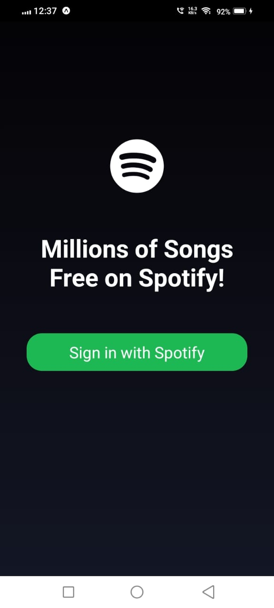
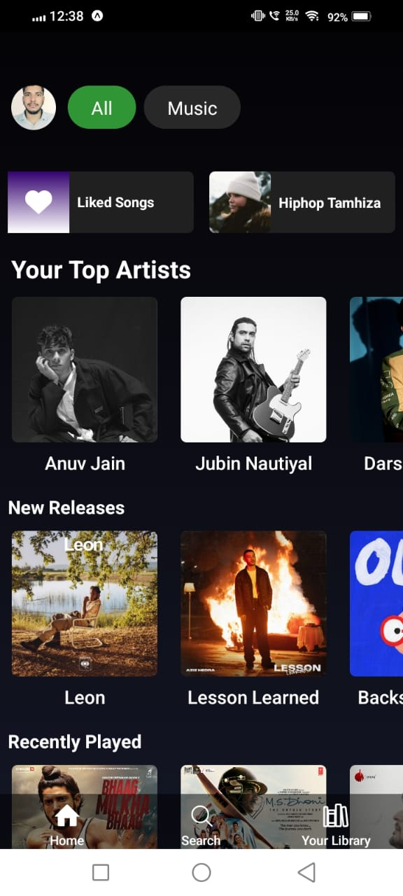
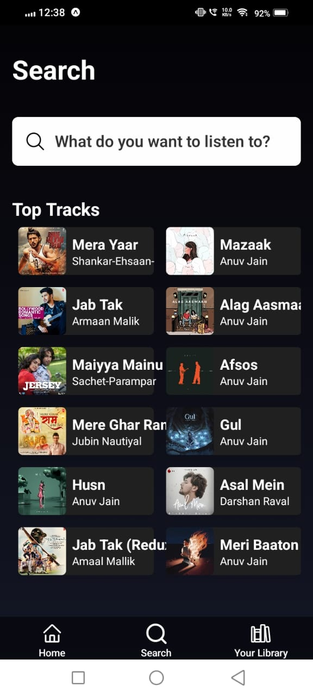
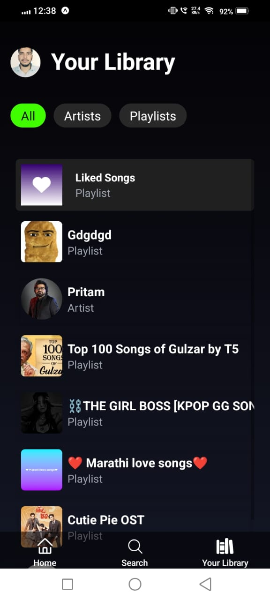
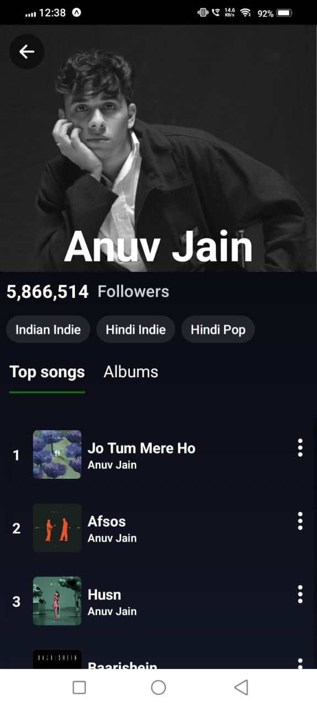
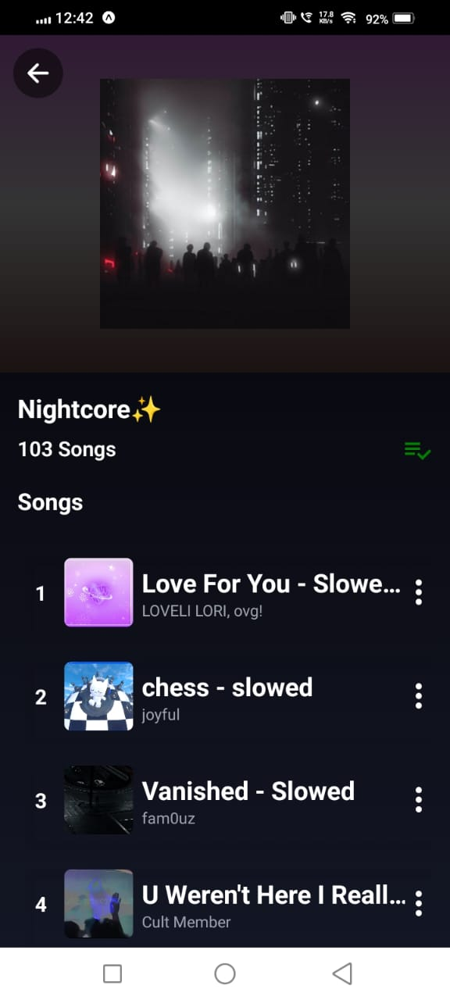
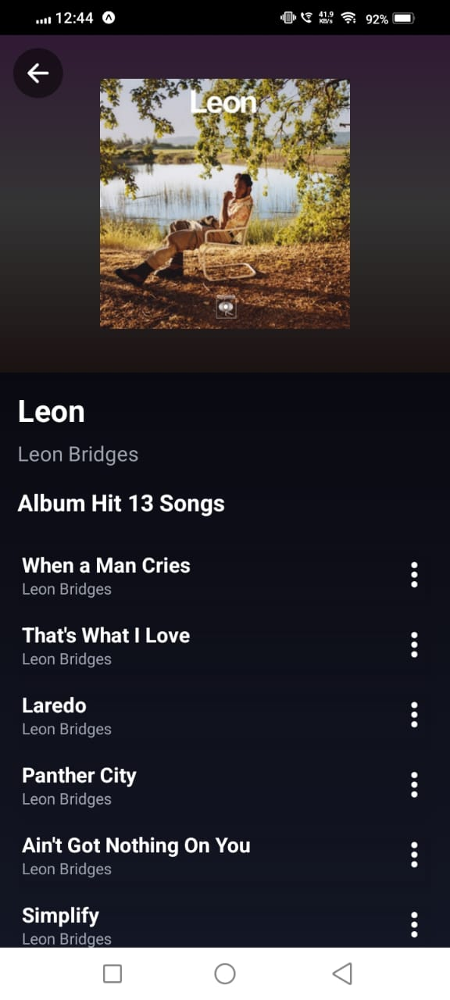

# Spotify Clone

A Spotify Clone built using modern web technologies, replicating core features of Spotify for an enhanced music streaming experience.

## UI images

### 1. log-in

### Tabs

### Artist, Album and Playlist screens

## Features

### User Authentication

- Secure login with Spotify OAuth
- User profile display with image, name, and account details

### Home Screen

- Discover new music through the latest releases
- Explore top charts and trending tracks

### Search

- Search for songs, albums, artists, and playlists
- Categorized search results for better navigation

### Artist & Album Pages

- View artist details including image, followers, and genres
- Listen to top tracks by the artist
- Explore all the albums of a artist

### Playlist & Library Management

- Display user-created and saved playlists
- View playlist details including cover image, song list, owner, and follower count
- Follow and unfollow playlists

### Favorite Songs & Liked Playlists

- Browse the user's collection of liked songs
- View followed artists and their latest music
- Like and unlike songs with a single click

---

## Tech Stack

- React native for building the user interface with expo framework
- native for styling
- Redux for state management
- Spotify Web API for fetching music data
- OAuth 2.0 for user authentication
- Tailwind CSS for responsive and modern styling

---

## Getting Started

1. Clone the repository: `git clone https://gitlab.com/arvindkumar31.1/spotify-clone-with-react-native.git`
2. Install dependencies: `npm install`
3. Configure Spotify OAuth credentials in the `.env` file
4. Start the development server: `npm start`

---

## Future Improvements

- Offline mode for playing downloaded songs
- Playlist collaboration with other users
- Real-time lyrics display

---
